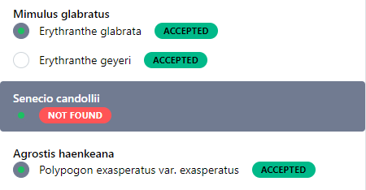
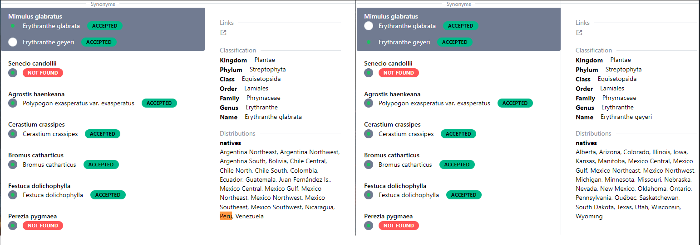

# Validador de Nombres
QuickBio posee un **validador de nombres** para cada Taxón, permitiendo:

- Verificar si el nombre de la especie está correctamente escrito (errores ortográficos).
- Obtener los sinonimos si estos están presentes (nombres aceptados).

## **Validadores por Taxón**

- Plants: [Plants of the World (POWO)](https://powo.science.kew.org/)
- Birds: [South American Classification Committee (SACC)](https://www.museum.lsu.edu/~Remsen/SACCBaseline.htm)
- Mammalia: TBA
- Amphibia: [Amphibia Web](https://amphibiaweb.org/)
- Reptile: [The Reptile Database](https://reptile-database.reptarium.cz/)

!!! info
    Actualmente se maneja un validador por Taxón, se estarán ampliando en futuras versiones.

!!! note
    En el caso de Flora no se usará Tropicos debido a que su base de datos está desactualizada, actualmente se encuentran en proceso de actualización y hasta que no esté implementada no se agregará a QuickBio

## **Lectura**

=== "Nombre incorrecto"

    Etiqueta Not Found.

    :   El nombre de la especie no se ha encontrado en la base de datos revisada, por lo cual el especialista tendrá que corregirlo en el excel.

        Esto es debido a errores ortográficos, el nombre correcto en el ejemplo es: *Senecio candollei*

=== "Nombre aceptado"
    Etiqueta Accepted.

    :   El nombre es aceptado y no posee sinonimos.

        El nombre aceptado de *Agrostis haenkeana* es *Polypogon exasperaus* acorde a `POWO`

=== "Multiples sinonimos"
    Etiquetas Accepted.

    :   Las opciones son los sinónimos de las especies, en el panel derecho se mostrarán los datos asociados a cada sinónimo.

    *Mimulus glabratus* posee dos sinonimos 

    :   -   Erythranthe glabrata: Distribuida en Perú - Nativa
        -   Erythranthe geyeri: No se encuentra distribuida en Perú

    La elección del sinónimo depende del criterio del especialista. 

    

    (Click derecho - Abrir en nueva pestaña para observar mejor la imagen)

---

!!! tip
    Se recomienda primero corregir los nombres de las especias con la etiqueta Not Found antes elegir los sinónimos en caso existan.

    Las opciones únicas te dan la certeza del nombre aceptado, con lo cual no es necesario revisarlas para optimizar tu tiempo.

## **Actualización del excel**

Una vez corregido los nombres incorrectos y seleccionada las opciones de los sinónimos, al descargar el excel se actualizarán los registros con las opciones seleccionadas.

`QuickBio_format` ahora será `AcceptedNames` modificando el grupo `taxonomy` y agregando un nuevo grupo `old_taxonomy`:

- `taxonomy`: Contiene la actualización de la clasificación taxonómica acorde a la base de datos revisada.
- `old_taxonomy`: Contiene los registros previos a la actualización.

!!! info
    Solo `taxonomy` es usado en el procesamiento de datos, `old_taxonomy` se mantiene como registro histórico previo a la validación de nombres.

!!! warning
    Es posible que dependiendo del Taxón aparezcan columnas sin datos debido a que la base de datos revisada no contiene la clasificación completa.
    Estas columnas tienen que ser eliminadas, en futuras versiones se eliminarán automaticamente.

!!! failure
    El módulo `Analisis de Biodiversidad` no aceptan espacios vacíos en los grupos `zones` y `taxonomy`, por ello es recomendable validar los nombres para autocompletar todas las columnas.